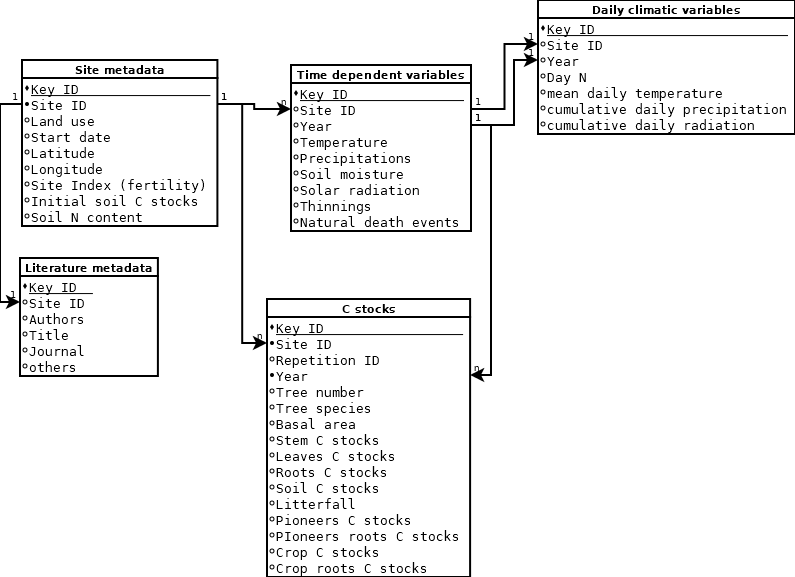

```{r setup, include=FALSE}
knitr::opts_chunk$set(echo = TRUE)
```

# Scope and requirements
The main aim of this document is to define a database structure for collecting data from long-term experiments to be used in calibrating and comparing models with coupled biomass decomposition and growth.
The database aims at including diverse ecosystems and land uses (different approach of forestry, plantations, possibly agroforestry), over a latitudinal gradient as broad as possible. This will facilitate the development of new models able to:
* Compare the GHG cost per unit of biomass produced of different land uses with a same model, increasing the robustness of LCA analyses
* Speed up the development of models able to deal with the increased complexity of modern forestry management systems
The questions that the models that will be built on the dataset aim at answering are, among others:
* What is the most cost effective land use, in terms of net climate impact, in a certain location?
* What are the possible impacts of a disturbance, anthropogenic or natural, on a certain land use? Are there hidden costs in terms of resilience in specific land uses?


# Database components
The database structure is designed to be viable for data assimilation research projects with many different models and aims at being as neutral as possible in terms of model structure, and it therefore aims at collecting all variables that could possibly be used in modeling. The database is of course allowing for NAs, and the data assimilation techniques the database is designed to serve are all able to deal with incomplete information.
The database is designed in four tables:

## Main C stocks and fluxes data (time series, with repetitions)
This table contains all the variables describing the C balance of the site. They can either be a state (C stocks in Mg ha-1) or a flux (C in Mg ha-1 y-1). The table can include repetitions.
The table does not consider plant age but basal area instead.
The table includes four fields for considering pioneer vegetation (grasses and shrubs in the first renovation phases or at the margin of the rows or growing on the ground as in a birch stand) as well as other crops (in the case of agroforestry).


## Additional time dependent variables
These are time dependent variables that do not include repetitions, and are therefore connected with a one to many relationship with the entries in the C table

### Climatic variables (time series)

### Management and disasters variables (time series)

### Additional variables (time series)


## Site metadata
These are non time dependent variables connected with a one to many relationship with all the time dependent variables,

## Literature metadata
These are non time dependent variables connected with a one to many relationship with all the time dependent variables. This table is redundant, and could be associated with the site metadata, but for convenience it is kept separate

# Database design




